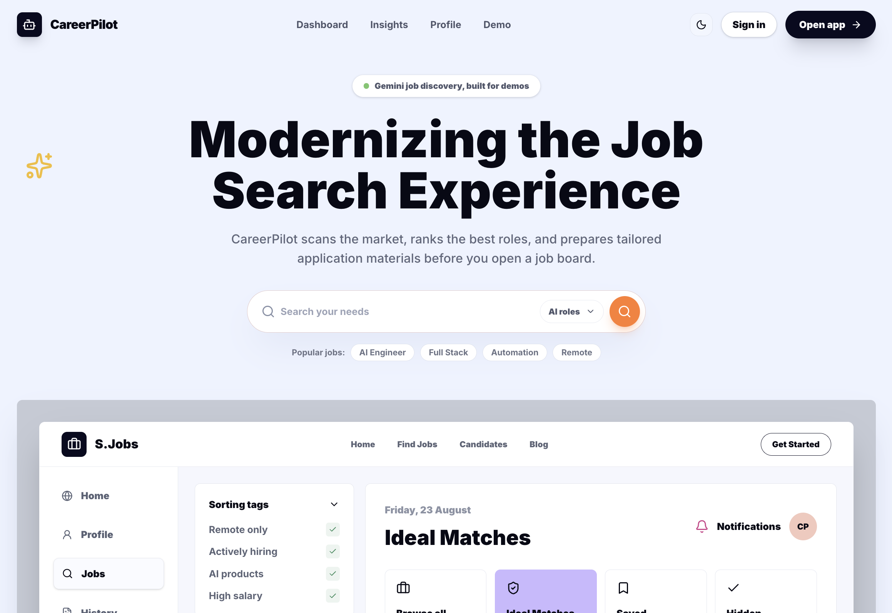
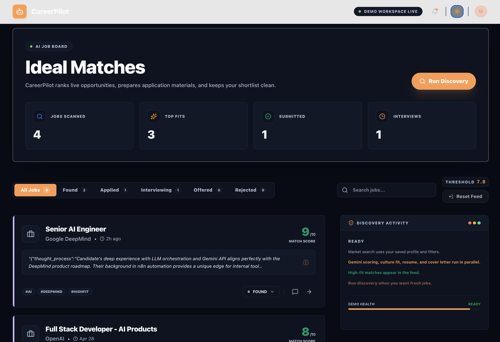
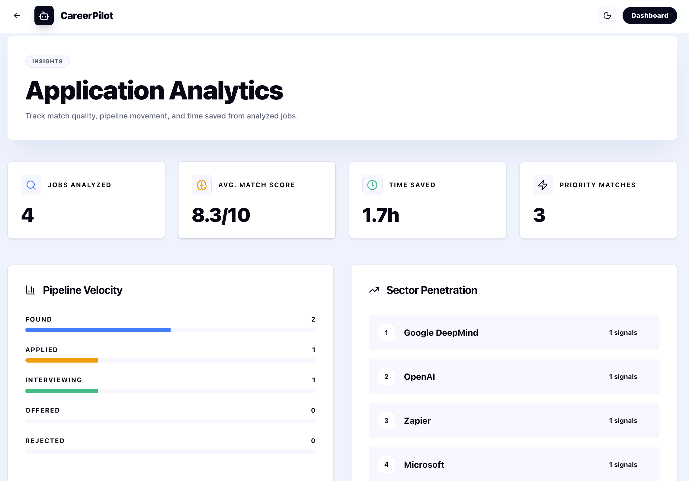
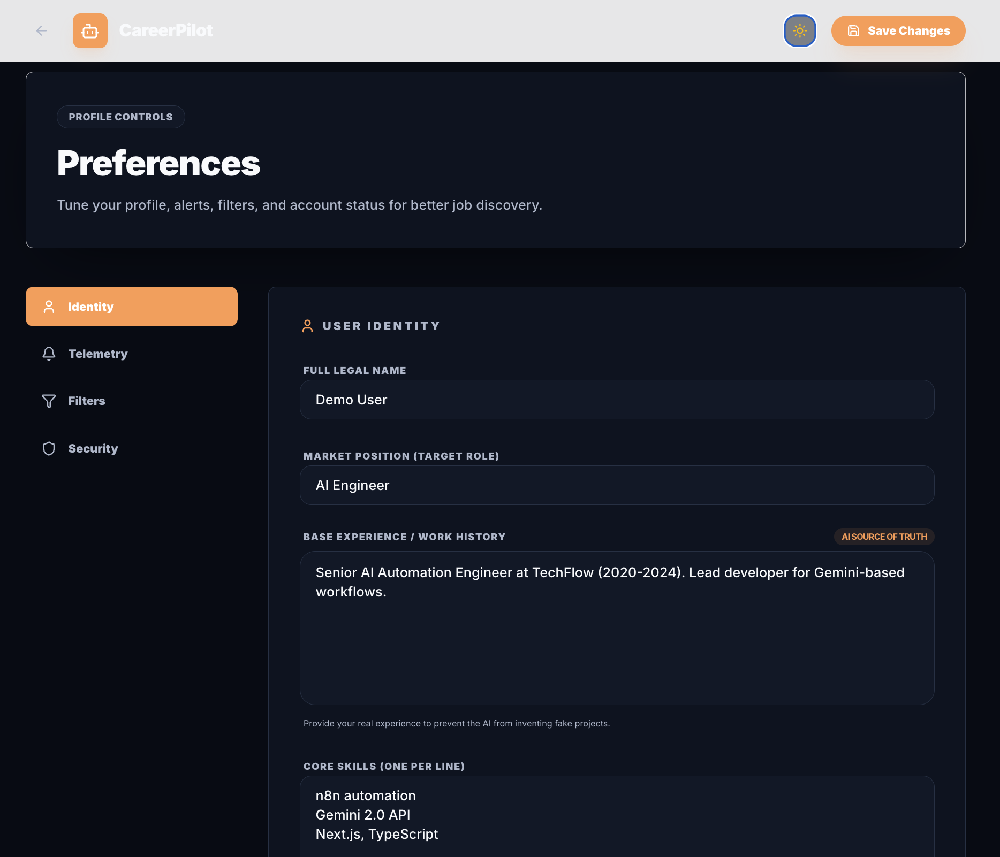
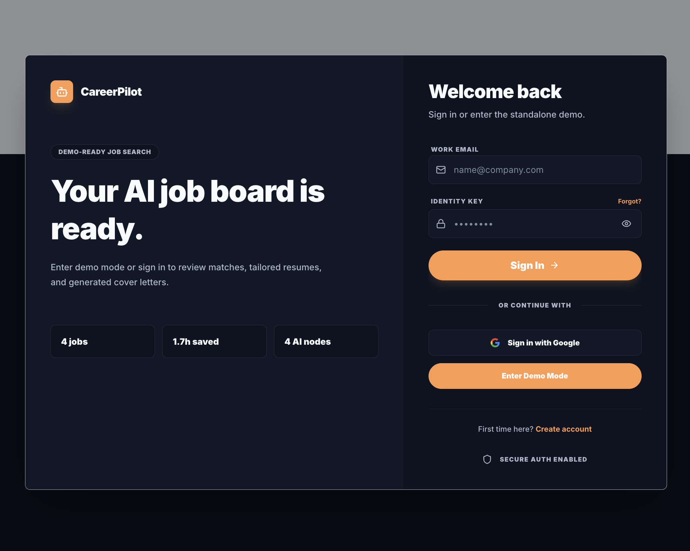

# CareerPilot AI

CareerPilot AI is an autonomous job discovery and application assistant. It searches for relevant roles, scores fit with Gemini, generates tailored application materials, and presents results in a Next.js dashboard backed by Supabase.

Built for the Gemini 3 Global Hackathon.

[Live Demo](https://career-pilot-ai-psi.vercel.app)

## Product Preview

### Landing Page



### Dashboard



### Analytics



### Settings



### Login and Demo Mode



## Features

- Autonomous job discovery through `POST /api/discover`.
- SerpAPI-powered job search based on saved Supabase profile and preferences.
- Four Gemini nodes per job: scorer, culture analyzer, resume tailor, and cover letter generator.
- Parallel Gemini execution with `Promise.all()` to keep demo runs fast on Vercel.
- Job-fit scoring from 1 to 10 with structured reasoning, matching skills, missing skills, and culture tags.
- Dashboard Run Discovery action for on-demand discovery without requiring n8n.
- Job detail drawer with tailored resume and cover letter rendered through ReactMarkdown.
- Copy Cover Letter action for generated cover letter text.
- Demo mode for live previews using `NEXT_PUBLIC_DEMO_MODE=true`.
- Dashboard analytics for Pipeline Velocity and Sector Penetration.
- Light and dark mode across the landing page, dashboard, login, settings, stats, and job detail views.

## Architecture

```text
User Profile
    |
    v
Next.js API Route: POST /api/discover
    |
    v
SerpAPI Job Search
    |
    v
Gemini 2.5 Flash Lite
    |-- Job scorer
    |-- Culture analyzer
    |-- Resume tailor
    |-- Cover letter generator
    |
    v
Supabase Database
    |
    v
Next.js Dashboard
```

The n8n workflows in `workflows/` remain available as an optional production automation path for scheduled discovery. The standalone Next.js route is designed so the demo can run on Vercel without relying on a shared n8n instance.

## Standalone Discovery API

CareerPilot includes a self-contained discovery endpoint:

```http
POST /api/discover
```

The route:

1. Loads the authenticated user's Supabase profile and preferences.
2. Searches for jobs using SerpAPI.
3. Sends each job through four Gemini nodes:
   - Job scorer
   - Culture analyzer
   - Resume tailor
   - Cover letter generator
4. Saves results to Supabase using the same jobs schema as the n8n workflow.
5. Returns a summary with discovered, saved, created, updated, and failed counts.

The default model is `gemini-2.5-flash-lite`, selected for cost-efficient demo runs. With the current cap of five jobs per run, one discovery request can make up to 20 Gemini calls because each job runs four AI nodes in parallel.

## Tech Stack

- Frontend: Next.js 16, React 19, TypeScript, Tailwind CSS
- Backend: Next.js API Routes, Supabase PostgreSQL
- Authentication and data: Supabase Auth, Supabase Row Level Security
- AI: Gemini 2.5 Flash Lite by default
- Job search: SerpAPI
- Optional automation: n8n workflows
- Deployment: Vercel

## Quick Start

### Prerequisites

- Node.js 18 or newer
- Supabase account
- Gemini API key
- SerpAPI key
- n8n, optional, for scheduled production automation

### Installation

1. Clone the repository.

   ```bash
   git clone https://github.com/SKYDARTIST/career-pilot-ai
   cd career-pilot-ai
   ```

2. Install dependencies.

   ```bash
   npm install
   ```

3. Configure environment variables.

   ```bash
   cp .env.local.example .env.local
   ```

   Required for standalone discovery:

   ```bash
   GEMINI_API_KEY=your-gemini-key
   GEMINI_MODEL=gemini-2.5-flash-lite
   SERPAPI_KEY=your-serpapi-key
   ```

   Required for demo login:

   ```bash
   NEXT_PUBLIC_DEMO_MODE=true
   ```

4. Start the development server.

   ```bash
   npm run dev
   ```

5. Open the app.

   ```text
   http://localhost:3000
   ```

6. Run discovery from the dashboard.

   - Open `/login`.
   - Click Enter Demo Mode if demo mode is enabled.
   - Open `/dashboard`.
   - Click Run Discovery.

## Environment Variables

Core application variables are defined in `.env.local.example`.

| Variable | Purpose |
| --- | --- |
| `NEXT_PUBLIC_SUPABASE_URL` | Public Supabase project URL |
| `NEXT_PUBLIC_SUPABASE_ANON_KEY` | Supabase anon key for browser access |
| `SUPABASE_SERVICE_ROLE_KEY` | Server-side Supabase service role key |
| `CAREER_PILOT_API_KEY` | Server-to-server API key for workflow integrations |
| `GEMINI_API_KEY` | Gemini API key |
| `GEMINI_MODEL` | Gemini model, defaults to `gemini-2.5-flash-lite` |
| `SERPAPI_KEY` | SerpAPI key for Google Jobs search |
| `NEXT_PUBLIC_DEMO_MODE` | Enables demo login when set to `true` |

## Optional n8n Workflow

The repository still includes the n8n workflow templates for scheduled discovery.

1. Open n8n at `http://localhost:5678`.
2. Import `workflows/job-discovery.template.json`.
3. Configure n8n variables.

| Variable | Description |
| --- | --- |
| `GEMINI_API_KEY` | Gemini API key from AI Studio |
| `SERPAPI_KEY` | SerpAPI key |
| `CAREER_PILOT_API_KEY` | Same as in `.env.local` |
| `CAREER_PILOT_API_URL` | Local or deployed CareerPilot URL |
| `CAREER_PILOT_USER_ID` | Supabase user ID |

## Project Structure

```text
career-pilot-ai/
├── src/
│   ├── app/
│   │   ├── api/
│   │   │   └── discover/
│   │   ├── dashboard/
│   │   ├── jobs/
│   │   ├── login/
│   │   ├── settings/
│   │   └── components/
│   ├── hooks/
│   └── lib/
├── workflows/
├── prompts/
├── data/
├── public/
│   └── readme/
└── README.md
```

## Security

- Supabase Row Level Security is expected on all user data tables.
- API key authentication is supported for server-to-server workflow calls.
- User-scoped queries isolate each user's jobs and preferences.
- Distribution files do not include secrets.
- `.env.local` is gitignored.
- Demo mode is intended for public previews and should not be used as a security boundary.

## Documentation

- [Production Setup Guide](./PRODUCTION_SETUP_GUIDE.md)
- [Hackathon Submission](./HACKATHON_SUBMISSION.md)
- [Enhancements Guide](./ENHANCEMENTS.md)
- [Terms of Service](./TERMS_OF_SERVICE.md)
- [Privacy Policy](./PRIVACY_POLICY.md)

## License

This project is licensed under the MIT License. See [LICENSE](./LICENSE).

## Contact

- GitHub: [@SKYDARTIST](https://github.com/SKYDARTIST)
- X: [@AakashBuild](https://x.com/AakashBuild)
